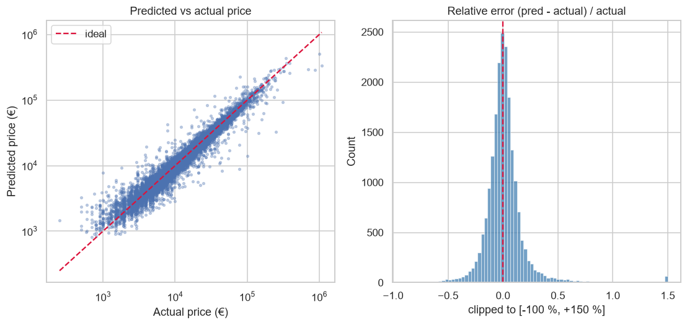
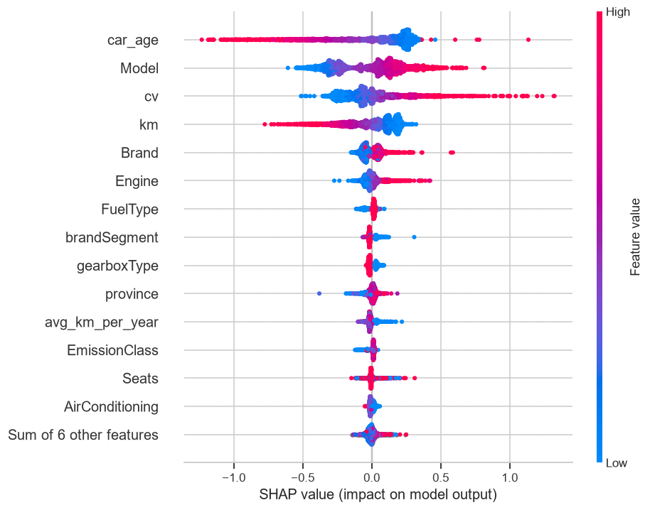
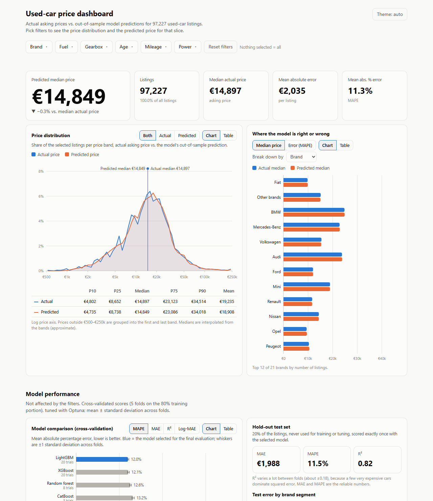

# Used-car price prediction

Predicts the asking price of Italian used-car listings (~101k after cleaning) from brand, model, age, mileage, power,
fuel, gearbox and equipment. The pipeline uses cross-validated model selection with Optuna, and a hold-out test set
that is scored once. An interactive [dashboard](#interactive-dashboard) presents the results.

## Results

Selected model: **LightGBM**, trained on log-price. Errors are in euros; MAPE is the mean absolute percentage error.

| | MAE | MAPE | R² |
|---|---|---|---|
| 5-fold CV on the 80 % training portion (mean ± std) | 2,124 ± 160 € | 12.0 % | 0.66 ± 0.18 |
| **Hold-out test set (20 %, scored once)** | **1,988 €** | **11.5 %** | 0.82 |

R² varies widely between folds (std 0.18) because a few very expensive cars dominate squared error. MAE and MAPE are the
reliable metrics, and they agree between CV and test.

### Model comparison (5-fold CV, tuned with Optuna)

| Model | Trials | CV MAE (€) | CV MAPE | CV R² | CV MAE on log-price |
|---|---|---|---|---|---|
| **LightGBM** | 20 | 2,124 ± 160 | **12.0 %** | 0.658 | **0.1131** |
| XGBoost | 20 | 2,129 ± 147 | 12.1 % | 0.661 | 0.1136 |
| Random forest | 8 | 2,162 ± 147 | 12.6 % | 0.654 | 0.1184 |
| CatBoost | 3 | 2,409 ± 164 | 13.2 % | 0.641 | 0.1251 |
| Polynomial (degree 2) Ridge | 15 | 3,342 ± 205 | 18.1 % | 0.540 | 0.1691 |
| Ridge | 20 | 3,819 ± 207 | 20.9 % | 0.513 | 0.1930 |
| ElasticNet | 15 | 3,837 ± 207 | 20.8 % | 0.511 | 0.1930 |
| Median baseline | – | 10,714 ± 203 | 94.6 % | -0.03 | 0.6270 |

- LightGBM and XGBoost are tied: the gap (0.0005 in log-price) is inside fold-to-fold noise. LightGBM is selected because it has the lowest value.
- Trial budgets differ per model (sized to fit time). CatBoost is ~20× slower to fit and got 3 trials in a reduced search space, so its rank reflects that budget.
- The learning curve (train MAE ≈ 1,200 € vs. validation ≈ 2,150 €, still falling at full size) indicates a variance-limited model.

### Error by brand segment (test set)

| Segment | Cars | MAPE | Median APE |
|---|---|---|---|
| Luxury | 5,786 | 9.9 % | 6.6 % |
| Ordinary | 13,375 | 11.5 % | 7.0 % |
| High luxury | 462 | 16.2 % | 9.1 % |
| Niche (rare brands) | 613 | 23.6 % | 12.2 % |

Rare brands have the largest errors: few examples and a wide price spread. On the test set, 63 % of predictions are within
±10 % of the asking price and 87 % within ±20 %.



### Price drivers (SHAP)

Car age, model, engine power and mileage dominate. Older and higher-mileage cars are cheaper; more powerful cars cost more.



## Method

- **Cleaning** (`data.py`): fixed plausibility rules (duplicates, year, mileage per year, power, engine size, seats,
  consumption, emissions), configured in `configs/default.yaml`. No statistic is learned from the data at this stage.
- **Splits** (`evaluate.py`): a 20 % hold-out test set and 5-fold CV on the rest, both stratified on price bins.
- **Features** (`features.py`): `FeatureBuilder` computes car age, km per year, km relative to expected, an engine-size
  imputation from power, a brand segment and a "special trim" keyword flag. Its statistics (km-per-year quantile, most
  frequent brands, imputer, winsorisation bounds) are learned in `fit`, i.e. on training data only.
- **Encoding** (`pipelines.py`): numeric scaling and one-hot for the linear models; cross-fitted target encoding for
  `Brand`, `Model` and `province`; native categoricals for CatBoost.
- **Target:** every model is wrapped in `TransformedTargetRegressor(log1p / expm1)`, so training is on log-price and
  predictions are in euros.
- **Models and tuning** (`tuning.py`): 8 models; Optuna (TPE sampler, median pruner) minimises the mean CV MAE on
  log-price. Trial budgets per model are set in `configs/default.yaml`.
- **Selection and test** (`train.py`): the model with the lowest CV error is refit on the full training portion and
  scored once on the test set (`--final`).

## Interactive dashboard

`docs/index.html` is a single self-contained page (no server, no external libraries). Open it in a browser, or publish it
with GitHub Pages (Settings → Pages → branch `main`, folder `/docs`).



- **Filters:** brand, fuel, gearbox, age, mileage and power (multi-select; nothing selected = all). Option counts update
  with the other filters, and the selection is stored in the URL (`#brand=1&fuel=0`).
- **Price distribution:** actual vs. predicted price bands with medians and percentiles, plus a breakdown by brand, fuel,
  gearbox, age, mileage or power showing where the model over- or under-predicts.
- **Model performance:** the CV comparison with a switchable metric, and the hold-out test results. Every chart has a table view.
- **Predictions:** each listing is predicted by a model that never saw it (out-of-fold for training rows, the final model
  for test rows). Errors on the page cover all listings, so they differ slightly from the test-set figures above.
- **Privacy:** the page embeds only counts, sums and histograms per filter combination. Combinations with fewer than 5
  listings are hidden (96.1 % of listings stay visible). The hidden cars are rarer and harder to price (~27 % MAPE), so
  the errors on the page are slightly optimistic; the page footer states this.

Rebuild with `python -m car_price.dashboard` (`--refresh` recomputes the predictions). Opening `docs/index.html#selftest`
runs a built-in check of the filter arithmetic against independently computed values; the result appears in the page title.

## Repository layout

```
configs/default.yaml        seed, cleaning constants, CV settings, Optuna trial budgets
src/car_price/
  data.py                   loading and row-level cleaning
  features.py               FeatureBuilder (sklearn transformer)
  pipelines.py              pipeline factory for the 8 models
  evaluate.py               splits, CV loop, metrics, per-segment report
  tuning.py                 Optuna search spaces and study runner
  train.py                  command-line entry point
  dashboard.py              builds docs/index.html
  dashboard_template.html   dashboard page (HTML, CSS, JS)
notebooks/                  01 EDA · 02 cleaning and features · 03 CV and tuning · 04 final evaluation and SHAP
reports/results/            cv_leaderboard.csv (with best params), test_metrics.csv, test_segment_report.csv
reports/optuna.db           Optuna studies (read by notebook 03)
reports/figures/            figures used in this README
docs/index.html             generated dashboard
scripts/make_sample.py      generates the synthetic sample
tests/                      pytest suite (runs on the synthetic sample)
data/sample/                synthetic dataset with the raw schema
```

## Reproducing

```bash
python -m venv .venv && .venv/Scripts/activate      # or: source .venv/bin/activate
pip install -e ".[dev]"
pytest                                               # ~15 s, uses the synthetic sample

# with the private data at data/raw/auto_price.csv:
python -m car_price.train --model all                # CV + Optuna for every model, writes reports/results/
python -m car_price.train --final                    # refit the best model, score the test set once
python -m car_price.dashboard                        # rebuild docs/index.html
jupyter nbconvert --to notebook --execute --inplace notebooks/*.ipynb
```

Variants: `--model lgbm --trials 30`, `--trials 0` (untuned defaults), `--sample` (synthetic data).
Tuning all models takes several hours on a laptop CPU, mostly CatBoost and the large boosted models.

## Data

~178k raw listings, 25 columns (price, registration date, km, power, fuel, gearbox, brand, model, equipment, …). The
dataset is private and not redistributed. `data/sample/auto_price_sample.csv` is synthetic, generated by
`scripts/make_sample.py`, and exists so the tests and pipeline run anywhere; metrics computed on it are not meaningful.

## Limitations

- Asking prices from a single 2019 snapshot, not sale prices; market drift over time is not modelled.
- Point predictions only; there is no prediction interval.
- Rare brands (niche, high luxury) have the largest errors.
- Search budgets for random forest (8 trials) and CatBoost (3) are small; a larger budget could change their ranking.
- `province` is a feature and may act as a proxy for dealer or regional effects; its contribution was not measured separately.
